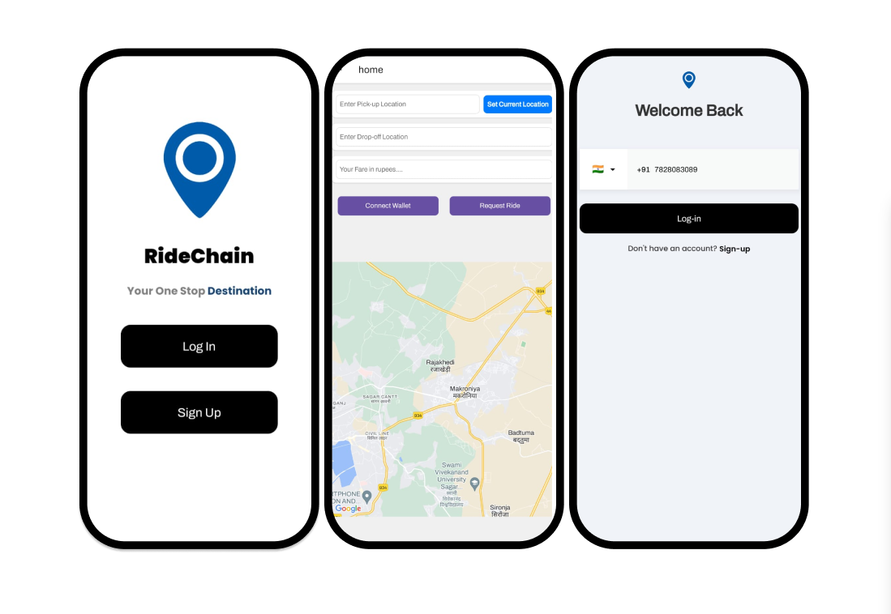

# RideChain

RideChain is a decentralized cab app built using React Native with Expo for the frontend, and Next.js with Solidity on the Ethereum blockchain for the backend. This project aims to provide a decentralized, trustless, and efficient platform for cab services.

<!-- add photo -->


- Backend hosted at [Link](https://ride-chain.vercel.app/)
- Contract Deployed at sepolia test net at address 0x256A8E43D1ED57D2E19a818960ba3089D457b8cb

## Demo video
[](https://www.youtube.com/watch?v=dQw4w9WgXcQ)

## System Design


## Table of Contents

- [Introduction](#introduction)
- [Features](#features)
- [Technologies Used](#technologies-used)
- [Getting Started](#getting-started)
  - [Prerequisites](#prerequisites)
  - [Installation](#installation)
  - [Running the App](#running-the-app)
- [Project Structure](#project-structure)
- [Smart Contracts](#smart-contracts)
- [API Endpoints](#api-endpoints)
- [Contributing](#contributing)
- [License](#license)
- [Acknowledgements](#acknowledgements)

## Introduction

RideChain is a decentralized application (dApp) for cab services, leveraging the power of blockchain technology to ensure transparency, security, and efficiency. By using Ethereum smart contracts, RideChain eliminates the need for intermediaries, allowing direct interaction between drivers and passengers.

## Features

- Decentralized booking and payment system
- Secure and transparent transactions using Ethereum blockchain
- Real-time ride tracking
- User authentication and profile management
- Rating and review system for drivers and passengers

## Technologies Used

- **Frontend:**
  - React Native
  - Expo

- **Backend:**
  - Next.js
  - Solidity
  - Ethereum blockchain

- **Others:**
  - Web3.js
  - IPFS for decentralized storage

## Getting Started

### Prerequisites

- Node.js and npm installed
- Expo CLI installed
- Metamask extension for Ethereum transactions
- Truffle or Hardhat for smart contract development

### Installation

1. **Clone the repository:**
   ```sh
   git clone https://github.com/yourusername/RideChain.git
   cd RideChain
   ```

2. **Install frontend dependencies:**
   ```sh
   cd frontend
   npm install
   ```

3. **Install backend dependencies:**
   ```sh
   cd ../backend
   npm install
   ```

### Running the App

1. **Start the Expo development server:**
   ```sh
   cd frontend
   expo start
   ```

2. **Deploy the smart contracts:**
   ```sh
   cd ../contracts
   truffle migrate --network development
   ```

3. **Start the Next.js server:**
   ```sh
   cd ../backend
   npm run dev
   ```

## Project Structure

```plaintext
RideChain/
├── frontend/          # React Native Expo app
├── backend/           # Next.js API server
├── web3/              # Solidity smart contracts
└── README.md          # Project README file
```

## Smart Contracts

The smart contracts for RideChain are written in Solidity and manage the core functionality of the app, including:

- Booking management
- Payment processing
- User authentication

### Contract Deployment

To deploy the smart contracts, use Truffle or Hardhat. Ensure you have a local Ethereum node running or use a service like Infura.

```sh
truffle migrate --network development
```

### Contract Interaction

Use Web3.js to interact with the deployed contracts in your frontend and backend code.

## API Endpoints

The Next.js backend provides several API endpoints for interacting with the app:

- **POST /api/register** - Register a new user
- **POST /api/book** - Book a ride
- **GET /api/rides** - Get ride history
- **POST /api/review** - Submit a review

## Contributing

We welcome contributions to RideChain! To contribute:

1. Fork the repository.
2. Create a new branch (`git checkout -b feature/your-feature`).
3. Make your changes.
4. Commit your changes (`git commit -m 'Add your feature'`).
5. Push to the branch (`git push origin feature/your-feature`).
6. Open a pull request.

## License

This project is licensed under the MIT License - see the [LICENSE](LICENSE) file for details.

## Acknowledgements

- [Ethereum](https://ethereum.org/)
- [React Native](https://reactnative.dev/)
- [Expo](https://expo.dev/)
- [Next.js](https://nextjs.org/)
- [Web3.js](https://web3js.readthedocs.io/)

## Contributors 

- [Aryaman Pathak](https://github.com/Aryamanpathak2022/)

---

Feel free to customize the README further based on your specific project details and requirements.
